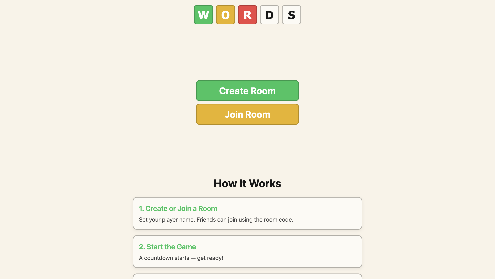

# Multiplayer Word Guessing Game



A fast-paced, real-time multiplayer word-guessing game where players compete to guess a hidden word before anyone else in the room does. Built with a modern web stack in a monorepo managed by Turborepo.

---

## 📌 Project Title

**To be decided** (codename: word-game)

##  Short Description

Players join a shared room to guess words from a fixed sequence. First to guess correctly earns points, then all progress to the next word. The game ends when the word pool is exhausted or the global timer runs out, and a leaderboard ranks players by points.

---

## 🗂️ Monorepo Structure

```
apps/
├── frontend/   → SvelteKit (Svelte 5) client UI
└── ws/         → Node.js + TypeScript WebSocket backend
```

Shared tooling managed by Turborepo for streamlined builds and caching.

---

## 🚀 Features

- Real-time multiplayer gameplay via WebSockets
- Synchronized countdown and word sequence
- Live hints broadcast when letters match
- Scoring and automatic progression to next word
- Final leaderboard by points
- Flexible game modes (timer + word pool size)

---

## 🛠️ Development Roadmap

1. **Initial MVP**: Basic lobby, room creation/join, guessing loop, scoring.

---

## 💻 Installation & Setup

1. **Clone the repo**
   ```bash
   git clone https://github.com/akshat-soni02/word-game.git
   cd word-game
   ```
2. **Install dependencies** (npm)
   ```bash
   npm install
   ```
3. **Run in development**

   frontend
   ```bash
   cd apps/frontend
   npm run dev -- --open
   ```

   ws
   ```bash
   cd apps/ws
   npm run build
   npm start
   ```

4. **Build for production**
   ```bash
   npm run build
   ```

---

## ⚙️ Usage

- **Create Room**: Host enters name, chooses mode, creates room.
- **Join Room**: Enter room code or click invite link.
- **Play**: Type guesses, watch real-time hints, earn points.
- **End**: View final leaderboard when time or pool ends.

---

## 📦 Deployment

- **Frontend**: Deployed `apps/frontend` to Vercel (`adapter-auto`).
- **Backend**: Deployed `apps/ws` to Google Cloud Run (Docker).

---

## 🙋‍♂️ About Me

Built by Akshat — Connect on [GitHub](https://github.com/akshat-soni02) or [LinkedIn](https://linkedin.com/in/-akshat-soni).

---

## 📚 Useful Links

- [Turborepo Docs](https://turborepo.org/docs)
- [SvelteKit Docs](https://kit.svelte.dev/docs)
- [WebSocket API (MDN)](https://developer.mozilla.org/docs/Web/API/WebSockets_API)

